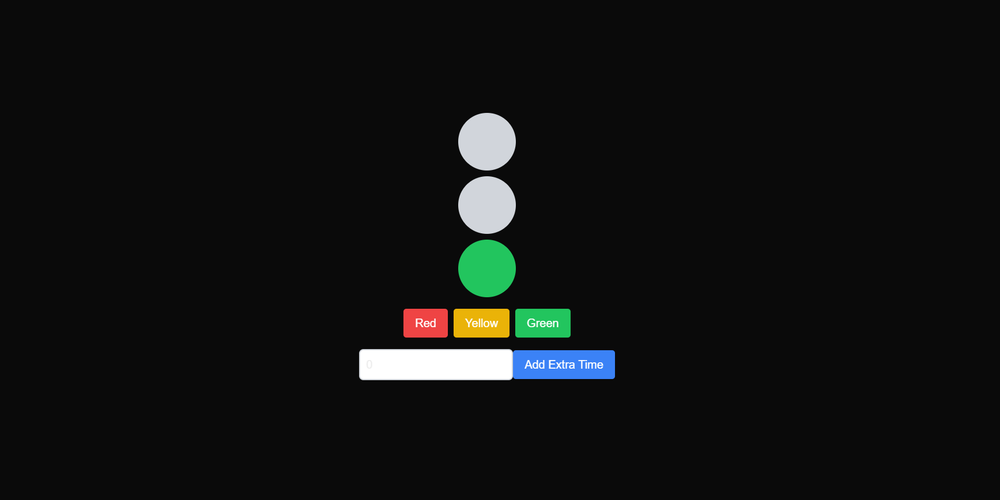

# Traffic Light System

A simple traffic light system built with Next.js, TypeScript, and Tailwind CSS. This project simulates a traffic light system with green, yellow, and red lights, cycling at specified intervals, and allows manual control and time adjustments.

## Features

- Cycles through traffic light colors:
  - **Green**: 15 seconds
  - **Yellow**: 5 seconds
  - **Red**: 10 seconds
- Includes manual buttons to switch the light to red, yellow, or green at any time.
- Allows users to increase the duration of each light by entering extra time in seconds.
- Option to add extra time for each light.

## Screenshot

Here is what the application looks like when running:


  
## Built With

- [Next.js](https://nextjs.org/)
- [React](https://reactjs.org/)
- [TypeScript](https://www.typescriptlang.org/)
- [Tailwind CSS](https://tailwindcss.com/)

## Getting Started

### Prerequisites

Make sure you have the following installed on your local machine:

- Node.js v20 or later
- npm (Node package manager)

### Installation

1. Clone the repository:

   ```bash
   git clone https://github.com/yourusername/traffic-light-system.git


### Step 2: Add the `README.md` to GitHub

1. **Navigate to your repository on GitHub**.
2. **Click on "Add file"** and select **"Create new file"**.
3. Name the file `README.md` and paste the content of your `README.md` file.
4. Commit the new file by clicking on **"Commit new file"**.

Alternatively, if you are working locally, you can do the following:

1. **Create the `README.md` file locally** in the root of your project:

   ```bash
   touch README.md
